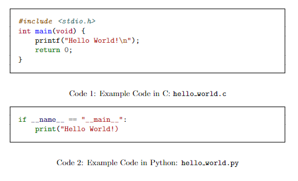

# Code Snippet with Box in LaTeX

There are some times that you need to include code snippet using LaTeX. Just like markdown, there are ways of formatting a code snippet in a way that can be distinguished from a normal text.

> This guide was made by using [Overleaf](https://overleaf.com).&#x20;

### Packages Required

* `[newfloat]{minted}`
* `{caption}`

```latex
\usepackage[newfloat]{minted}
\usepackage{caption}
```

### Environment

> Change this accordingly

```latex
\newminted{code}{frame=lines,framerule=2pt}
\newenvironment{code}{\captionsetup{type=listing}}{}
\SetupFloatingEnvironment{listing}{name=Code}
```

This will make `\code` as a code segment. With caption as `Code`.

### Example

```latex
\documentclass{article}

\usepackage[utf8]{inputenc}
\usepackage[newfloat]{minted}
\usepackage{caption}

\newminted{code}{frame=lines,framerule=2pt}
\newenvironment{code}{\captionsetup{type=listing}}{}
\SetupFloatingEnvironment{listing}{name=Code}

\begin{document}

\begin{code}
\begin{minted}[frame=single,framesep=10pt]{c}
#include <stdio.h>
int main(void) {
    printf("Hello World!\n");
    return 0;
}
\end{minted}
\captionof{listing}{Example Code in C: \texttt{hello\_world.c}}
\end{code}

\begin{code}
\begin{minted}[frame=single,framesep=10pt]{python}
if __name__ == "__main__":
    print("Hello World!)
\end{minted}
\captionof{listing}{Example Code in Python: \texttt{hello\_world.py}}
\end{code}


\end{document}
```

Will return

<figure><figcaption></figcaption></figure>

> Using `github.com/gijs-pennings/latex-homework` will make `#include` as non italic.

